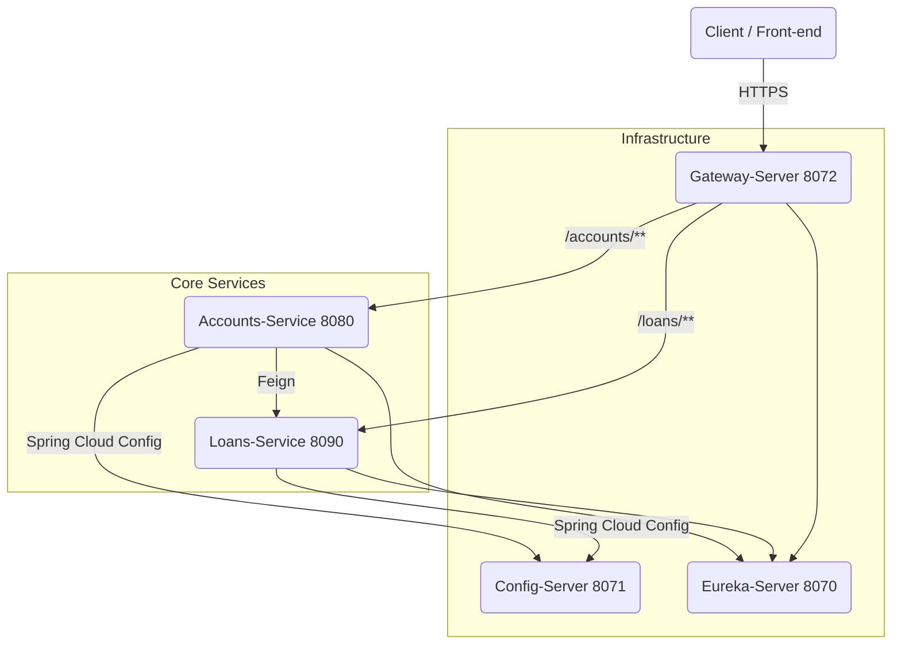

# Micro-services Banking Suite – Project Overview

## 1. Big-picture Architecture



> Every Spring Boot service externalises its configuration to **Config-Server** (`8071`) and registers itself with **Eureka** (`8070`). **Gateway-Server** (`8072`) is the single public entry-point used by clients.

---

## 2. The Micro-services in detail

### 2.1 Accounts-Service (`accounts`, port **8080**)
Responsible for customer onboarding and for exposing a consolidated *profile* view that also contains loan information.

Key endpoints (produces `application/json`):

| Verb | Path | Description |
|------|------|-------------|
| `POST` | `/api/create` | Create a new customer + bank account. Expects `CustomerDto` body |
| `GET` | `/api/fetch?mobileNumber=` | Fetch customer + account details, *and* calls Loans-Service to enrich the response |
| `GET` | `/api/build-info` | Build metadata |
| `GET` | `/api/contact-info` | Support contact taken from Config-Server |

Internally uses an in-memory **H2** database and a **Feign** client (`name = "loans"`) to talk to Loans-Service via Eureka.


### 2.2 Loans-Service (`loans`, port **8090**)
Manages loans linked to a customer's mobile number.

| Verb | Path | Description |
|------|------|-------------|
| `POST` | `/api/create?mobileNumber=` | Create a blank loan record for a customer |
| `GET`  | `/api/fetch?mobileNumber=` | Retrieve loan snapshot (`LoansDto`) |
| `PUT`  | `/api/update` | Update an existing loan (`LoansDto` body) |
| `DELETE`| `/api/delete?mobileNumber=` | Delete loan information |

Like Accounts-Service it uses H2 and exposes build / contact-info endpoints derived from Config-Server.


### 2.3 Config-Server (`configserver`, port **8071**)
• Centralised configuration backed by local `classpath:/config` files (`accounts.yml`, `loans.yml`, `gatewayserver.yml`, …).  
• Encrypts sensitive values with Spring Cloud Config's symmetric key (`encrypt.key`).

### 2.4 Eureka-Server (`eureka-server`, port **8070**)
• Acts as the **service registry**.  
• All services (`accounts`, `loans`, `gatewayserver`) register and renew heart-beats here.  
• Provides a web console at `http://localhost:8070/`.

### 2.5 Gateway-Server (`gatewayserver`, port **8072**)
• Single entry-point that applies cross-cutting concerns such as routing, resiliency, CORS and rate-limits.  
• Uses Spring Cloud Gateway.  
• Looks up target services via Eureka.

Example static routes (configured in `gatewayserver.yml`):
```
/accounts/**  -> accounts
/loans/**     -> loans
```
*(lower-case service-ids ensure compatibility with `discovery.locator.lower-case-service-id = true`)*

---

## 3. A Typical User Journey

Let's walk through the life-cycle of a brand-new customer called **Ayush**:

1. **Create account**  
   ```bash
   POST http://localhost:8072/accounts/api/create
   Content-Type: application/json
   
   {
     "name": "Ayush Jaipuriar",
     "email": "ayush@gmail.com",
     "mobileNumber": "9876543210",
     "accountsDto": {
       "accountNumber": "9876543210",
       "accountType": "SAVINGS",
       "branchAddress": "Ranchi"
     }
   }
   ```
   • Gateway routes the call to Accounts-Service (8080).  
   • Accounts checks duplicates, persists a `Customer` + `Accounts` record and returns:
   ```json
   { "statusCode": "201", "statusMsg": "Account created successfully" }
   ```

2. **Create an initial loan (optional)**  
   ```bash
   POST http://localhost:8072/loans/api/create?mobileNumber=9876543210
   ```
   • Gateway forwards to Loans-Service (8090) which inserts a default loan row.

3. **Fetch consolidated profile**  
   ```bash
   GET http://localhost:8072/accounts/api/fetch?mobileNumber=9876543210
   ```
   Response aggregated by Accounts-Service:
   ```json
   {
     "customer": {
       "name": "Ayush Jaipuriar",
       "email": "ayush@gmail.com",
       "mobileNumber": "9876543210",
       "accountsDto": {
         "accountNumber": 1234567890,
         "accountType": "Savings",
         "branchAddress": "Hyderabad"
       }
     },
     "loans": {
       "mobileNumber": "9876543210",
       "loanNumber": "548732457654",
       "loanType": "Home Loan",
       "totalLoan": 100000,
       "amountPaid": 1000,
       "outstandingAmount": 99000
     }
   }
   ```
   The loan block is fetched on-the-fly over Feign → Eureka → Loans-Service.

4. **Update or Delete loan**  
   ```bash
   PUT  /loans/api/update      # body = LoansDto
   DELETE /loans/api/delete?mobileNumber=9876543210
   ```
   Again these go through Gateway and hit Loans-Service directly.

---

## 4. Local Setup via Docker Compose
A `docker-compose.yml` file is provided to spin up all artefacts including the databases. Typical startup order:

1. `config-server`  
2. `eureka-server`  
3. `gatewayserver`  
4. `accounts` and `loans`

All containers share the same network and auto-discover each other through Eureka.

---

## 5. Observability: Tracing & Actuators
Every service exposes Spring Actuator (`/actuator/**`) endpoints for health checks, metrics and graceful shutdown. Discovery-client and Gateway actuator endpoints are enabled as well.

To facilitate debugging and monitoring in our distributed environment, we have implemented **distributed tracing** using a **correlation ID**.

*   **Generation:** The `Gateway-Server` generates a unique `ayush-drarc-correlation-id` for each incoming request that doesn't already have one.
*   **Propagation:** This ID is propagated across all subsequent microservice calls, from the `accounts-service` to the `loans-service` via Feign clients.
*   **Logging:** Every microservice is configured to log this correlation ID with each request, allowing for a unified view of a request's journey through the system.
*   **Client Visibility:** The correlation ID is also included in the response headers, making it accessible to the client for end-to-end tracking.

---

## 6. Comprehensive End-to-End Testing

This section provides a detailed testing framework to validate the complete functionality of the microservices banking suite, including distributed tracing, error handling, and system resilience.

### 6.1 Prerequisites & Setup

**Infrastructure Requirements:**
*   All services (`config-server`, `eureka-server`, `accounts`, `loans`, `gatewayserver`) are running and healthy
*   API client (Postman, cURL, or similar) with collection management capabilities
*   Access to console logs for all running services
*   Docker Compose environment (if using containerized setup)
*   Network connectivity between services (ports 8070-8090)

**Pre-Test Checklist:**
*   [ ] Clear console logs for all microservices
*   [ ] Verify Eureka dashboard shows all services registered (`http://localhost:8070/`)
*   [ ] Confirm Config-Server is serving configurations
*   [ ] Test basic health endpoints: `/actuator/health` on each service
*   [ ] Ensure no existing test data conflicts (clean H2 databases if needed)

### 6.2 Test Scenarios

#### 6.2.1 Happy Path Testing

**Scenario A: Complete Customer Lifecycle**

1.  **Create Customer Account**
    ```bash
    POST http://localhost:8072/accounts/api/create
    Content-Type: application/json
    
    {
      "name": "Ayush Jaipuriar",
      "email": "ayush@gmail.com",
      "mobileNumber": "9876543210",
      "accountsDto": {
        "accountNumber": "9876543210",
        "accountType": "SAVINGS",
        "branchAddress": "Ranchi"
      }
    }
    ```
    
    **Expected Response:**
    ```json
    {
      "statusCode": "201",
      "statusMsg": "Account created successfully"
    }
    ```
    
    **Verification Steps:**
    *   Status code: `201 Created`
    *   Response headers contain `ayush-drarc-correlation-id`
    *   Gateway logs show request routing to accounts-service
    *   Accounts-service logs show customer creation and validation
    *   H2 database contains new customer and account records

2.  **Create Loan Record**
    ```bash
    POST http://localhost:8072/loans/api/create?mobileNumber=9876543210
    ```
    
    **Expected Response:**
    ```json
    {
      "statusCode": "201",
      "statusMsg": "Loan created successfully"
    }
    ```
    
    **Verification Steps:**
    *   Status code: `201 Created`
    *   New correlation ID generated
    *   Loans-service logs show loan creation with default values
    *   Database contains loan record linked to mobile number

3.  **Fetch Consolidated Profile (Cross-Service Integration)**
    ```bash
    GET http://localhost:8072/accounts/api/fetch?mobileNumber=9876543210
    ```
    
    **Expected Response:**
    ```json
    {
      "customer": {
        "name": "Ayush Jaipuriar",
        "email": "ayush@gmail.com",
        "mobileNumber": "9876543210",
        "accountsDto": {
          "accountNumber": "9876543210",
          "accountType": "SAVINGS",
          "branchAddress": "Ranchi"
        }
      },
      "loans": {
        "mobileNumber": "9876543210",
        "loanNumber": "548732457654",
        "loanType": "Home Loan",
        "totalLoan": 100000,
        "amountPaid": 1000,
        "outstandingAmount": 99000
      }
    }
    ```
    
    **Verification Steps:**
    *   Status code: `200 OK`
    *   Correlation ID propagated across services
    *   Accounts-service successfully calls Loans-service via Feign
    *   Response contains both customer and loan information
    *   **Distributed Tracing Verification:**
        *   Search correlation ID in all service logs
        *   Gateway: `RequestTraceFilter` and `ResponseTraceFilter` entries
        *   Accounts: Controller and Service layer logs
        *   Loans: Controller logs showing Feign client call

4.  **Update Loan Information**
    ```bash
    PUT http://localhost:8072/loans/api/update
    Content-Type: application/json
    
    {
      "mobileNumber": "9876543210",
      "loanNumber": "548732457654",
      "loanType": "Personal Loan",
      "totalLoan": 50000,
      "amountPaid": 5000,
      "outstandingAmount": 45000
    }
    ```
    
    **Verification Steps:**
    *   Status code: `200 OK`
    *   Loan data updated in database
    *   Fetch profile again to verify changes persisted

5.  **Delete Loan Record**
    ```bash
    DELETE http://localhost:8072/loans/api/delete?mobileNumber=9876543210
    ```
    
    **Verification Steps:**
    *   Status code: `200 OK`
    *   Loan record removed from database
    *   Fetch profile shows no loan information

#### 6.2.2 Error Handling & Edge Cases

**Scenario B: Duplicate Customer Creation**
```bash
POST http://localhost:8072/accounts/api/create
# Use same mobile number as above
```
**Expected:** `409 Conflict` with appropriate error message

**Scenario C: Customer Not Found**
```bash
GET http://localhost:8072/accounts/api/fetch?mobileNumber=9999999999
```
**Expected:** `404 Not Found` with resource not found message

**Scenario D: Invalid Request Data**
```bash
POST http://localhost:8072/accounts/api/create
Content-Type: application/json

{
  "name": "",
  "email": "invalid-email",
  "mobileNumber": "123",
  "accountsDto": {}
}
```
**Expected:** `400 Bad Request` with validation error details

**Scenario E: Loans Service Unavailable (Circuit Breaker)**
*   Stop loans-service
*   Attempt to fetch customer profile
*   **Expected:** Fallback response or circuit breaker activation
*   Restart loans-service and verify recovery

#### 6.2.3 Configuration & Metadata Testing

**Scenario F: Build Information**
```bash
GET http://localhost:8072/accounts/api/build-info
GET http://localhost:8072/loans/api/build-info
```
**Verification:** JSON response with application metadata

**Scenario G: Contact Information**
```bash
GET http://localhost:8072/accounts/api/contact-info
GET http://localhost:8072/loans/api/contact-info
```
**Verification:** Contact details from Config-Server

**Scenario H: Actuator Endpoints**
```bash
GET http://localhost:8072/accounts/actuator/health
GET http://localhost:8072/loans/actuator/health
GET http://localhost:8072/actuator/health
```
**Verification:** Health status and service dependencies

### 6.3 Distributed Tracing Validation

**Correlation ID Flow Verification:**

1.  **Request Initiation:**
    *   Gateway generates correlation ID for new requests
    *   ID format: `ayush-drarc-correlation-id: <uuid>`
    *   Log entry: `RequestTraceFilter: Generated correlation-id: <uuid>`

2.  **Service-to-Service Propagation:**
    *   Accounts-service receives correlation ID in headers
    *   Feign client includes correlation ID in outbound calls
    *   Loans-service receives and logs correlation ID
    *   Log pattern: `Correlation ID: <uuid>`

3.  **Response Flow:**
    *   Gateway adds correlation ID to response headers
    *   Client receives correlation ID for tracking
    *   Log entry: `ResponseTraceFilter: Correlation ID: <uuid>`

**Tracing Verification Commands:**
```bash
# Search for correlation ID across all service logs
grep "ayush-drarc-correlation-id" gateway-logs.txt
grep "ayush-drarc-correlation-id" accounts-logs.txt
grep "ayush-drarc-correlation-id" loans-logs.txt
```

### 6.4 Performance & Load Testing

**Scenario I: Concurrent Customer Creation**
*   Create 10 customers simultaneously
*   Verify all requests complete successfully
*   Check for correlation ID uniqueness
*   Monitor service response times

**Scenario J: High-Frequency Profile Fetching**
*   Fetch same customer profile 50 times rapidly
*   Verify consistent responses
*   Monitor Feign client performance
*   Check for any timeout or circuit breaker issues

### 6.5 Service Discovery & Resilience Testing

**Scenario K: Service Restart**
1.  Stop accounts-service
2.  Attempt customer creation (should fail)
3.  Restart accounts-service
4.  Verify service re-registers with Eureka
5.  Retry customer creation (should succeed)

**Scenario L: Config-Server Dependency**
1.  Stop config-server
2.  Verify services continue operating with cached config
3.  Restart config-server
4.  Verify configuration refresh

### 6.6 Test Data Management

**Cleanup Procedures:**
```bash
# Clear test data between scenarios
DELETE http://localhost:8072/loans/api/delete?mobileNumber=9876543210
# Note: Customer deletion endpoint may need to be implemented
```

**Test Data Isolation:**
*   Use unique mobile numbers for each test scenario
*   Implement test data cleanup in test scripts
*   Consider using separate H2 databases for testing

### 6.7 Automated Testing Scripts

**Postman Collection Structure:**
```
Banking Microservices Tests/
├── Setup/
│   ├── Health Check All Services
│   └── Clear Test Data
├── Happy Path/
│   ├── Create Customer
│   ├── Create Loan
│   ├── Fetch Profile
│   ├── Update Loan
│   └── Delete Loan
├── Error Scenarios/
│   ├── Duplicate Customer
│   ├── Customer Not Found
│   ├── Invalid Data
│   └── Service Unavailable
└── Verification/
    ├── Build Info
    ├── Contact Info
    └── Actuator Health
```

**Test Execution Order:**
1.  Run setup tests to ensure environment readiness
2.  Execute happy path scenarios sequentially
3.  Run error handling tests
4.  Perform configuration and metadata tests
5.  Execute performance tests
6.  Run service discovery tests
7.  Clean up test data

### 6.8 Success Criteria

A successful end-to-end test run should demonstrate:

*   ✅ All services start and register with Eureka
*   ✅ Customer creation, loan management, and profile fetching work correctly
*   ✅ Distributed tracing correlation IDs propagate across all services
*   ✅ Error scenarios return appropriate HTTP status codes and messages
*   ✅ Circuit breaker functionality works when services are unavailable
*   ✅ Configuration is properly loaded from Config-Server
*   ✅ All actuator endpoints return healthy status
*   ✅ Performance remains acceptable under normal load
*   ✅ Services recover gracefully after restart

**Test Report Template:**
```
Test Run: <timestamp>
Duration: <duration>
Services Tested: config-server, eureka-server, gatewayserver, accounts, loans
Scenarios Executed: <count>
Passed: <count>
Failed: <count>
Correlation ID Propagation: ✅/❌
Circuit Breaker Functionality: ✅/❌
Performance Acceptable: ✅/❌
```

If all criteria are met, the microservices banking suite is ready for production deployment.

---

## 7. Security & Resilience (Future scope)
The current blueprint is open (no authentication). You can layer the following without changing service contracts:

1. OAuth2 / Keycloak integration at Gateway level.
2. The Feign client in `accounts` now has a `LoansFallback` implementation, using Resilience4j circuit-breakers for interactions with `loans-service`.
3. Centralised logging (ELK) and distributed tracing (Zipkin).

---

Happy coding! :rocket: 