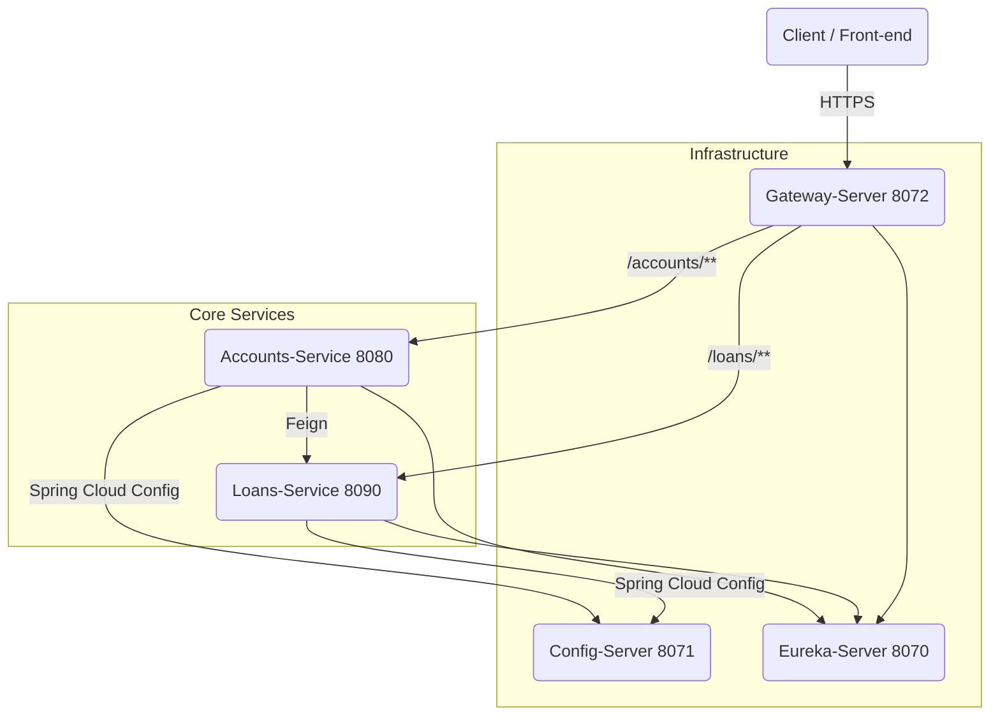

# Micro-services Banking Suite – Project Overview

## 1. Big-picture Architecture



> Every Spring Boot service externalises its configuration to **Config-Server** (`8071`) and registers itself with **Eureka** (`8070`). **Gateway-Server** (`8072`) is the single public entry-point used by clients.

---

## 2. The Micro-services in detail

### 2.1 Accounts-Service (`accounts`, port **8080**)
Responsible for customer onboarding and for exposing a consolidated *profile* view that also contains loan information.

Key endpoints (produces `application/json`):

| Verb | Path | Description |
|------|------|-------------|
| `POST` | `/api/create` | Create a new customer + bank account. Expects `CustomerDto` body |
| `GET` | `/api/fetch?mobileNumber=` | Fetch customer + account details, *and* calls Loans-Service to enrich the response |
| `GET` | `/api/build-info` | Build metadata |
| `GET` | `/api/contact-info` | Support contact taken from Config-Server |

Internally uses an in-memory **H2** database and a **Feign** client (`name = "loans"`) to talk to Loans-Service via Eureka.


### 2.2 Loans-Service (`loans`, port **8090**)
Manages loans linked to a customer's mobile number.

| Verb | Path | Description |
|------|------|-------------|
| `POST` | `/api/create?mobileNumber=` | Create a blank loan record for a customer |
| `GET`  | `/api/fetch?mobileNumber=` | Retrieve loan snapshot (`LoansDto`) |
| `PUT`  | `/api/update` | Update an existing loan (`LoansDto` body) |
| `DELETE`| `/api/delete?mobileNumber=` | Delete loan information |

Like Accounts-Service it uses H2 and exposes build / contact-info endpoints derived from Config-Server.


### 2.3 Config-Server (`configserver`, port **8071**)
• Centralised configuration backed by local `classpath:/config` files (`accounts.yml`, `loans.yml`, `gatewayserver.yml`, …).  
• Encrypts sensitive values with Spring Cloud Config's symmetric key (`encrypt.key`).

### 2.4 Eureka-Server (`eureka-server`, port **8070**)
• Acts as the **service registry**.  
• All services (`accounts`, `loans`, `gatewayserver`) register and renew heart-beats here.  
• Provides a web console at `http://localhost:8070/`.

### 2.5 Gateway-Server (`gatewayserver`, port **8072**)
• Single entry-point that applies cross-cutting concerns such as routing, resiliency, CORS and rate-limits.  
• Uses Spring Cloud Gateway.  
• Looks up target services via Eureka.

Example static routes (configured in `gatewayserver.yml`):
```
/accounts/**  -> accounts
/loans/**     -> loans
```
*(lower-case service-ids ensure compatibility with `discovery.locator.lower-case-service-id = true`)*

---

## 3. A Typical User Journey

Let's walk through the life-cycle of a brand-new customer called **Ayush**:

1. **Create account**  
   ```bash
   POST http://localhost:8072/accounts/api/create
   Content-Type: application/json
   
   {
     "name": "Ayush Jaipuriar",
     "email": "ayush@gmail.com",
     "mobileNumber": "9876543210",
     "accountsDto": {
       "accountNumber": "9876543210",
       "accountType": "SAVINGS",
       "branchAddress": "Ranchi"
     }
   }
   ```
   • Gateway routes the call to Accounts-Service (8080).  
   • Accounts checks duplicates, persists a `Customer` + `Accounts` record and returns:
   ```json
   { "statusCode": "201", "statusMsg": "Account created successfully" }
   ```

2. **Create an initial loan (optional)**  
   ```bash
   POST http://localhost:8072/loans/api/create?mobileNumber=9876543210
   ```
   • Gateway forwards to Loans-Service (8090) which inserts a default loan row.

3. **Fetch consolidated profile**  
   ```bash
   GET http://localhost:8072/accounts/api/fetch?mobileNumber=9876543210
   ```
   Response aggregated by Accounts-Service:
   ```json
   {
     "customer": {
       "name": "Ayush Jaipuriar",
       "email": "ayush@gmail.com",
       "mobileNumber": "9876543210",
       "accountsDto": {
         "accountNumber": 1234567890,
         "accountType": "Savings",
         "branchAddress": "Hyderabad"
       }
     },
     "loans": {
       "mobileNumber": "9876543210",
       "loanNumber": "548732457654",
       "loanType": "Home Loan",
       "totalLoan": 100000,
       "amountPaid": 1000,
       "outstandingAmount": 99000
     }
   }
   ```
   The loan block is fetched on-the-fly over Feign → Eureka → Loans-Service.

4. **Update or Delete loan**  
   ```bash
   PUT  /loans/api/update      # body = LoansDto
   DELETE /loans/api/delete?mobileNumber=9876543210
   ```
   Again these go through Gateway and hit Loans-Service directly.

---

## 4. Local Setup via Docker Compose
A `docker-compose.yml` file is provided to spin up all artefacts including the databases. Typical startup order:

1. `config-server`  
2. `eureka-server`  
3. `gatewayserver`  
4. `accounts` and `loans`

All containers share the same network and auto-discover each other through Eureka.

---

## 5. Observability & Actuators
Every service exposes Spring Actuator (`/actuator/**`) endpoints for health checks, metrics and graceful shutdown. Discovery-client and Gateway actuator endpoints are enabled as well.

---

## 6. Security & Resilience (Future scope)
The current blueprint is open (no authentication). You can layer the following without changing service contracts:

1. OAuth2 / Keycloak integration at Gateway level.
2. Resilience4j circuit-breakers for Feign interactions (Accounts → Loans).
3. Centralised logging (ELK) and distributed tracing (Zipkin).

---

Happy coding! :rocket: 